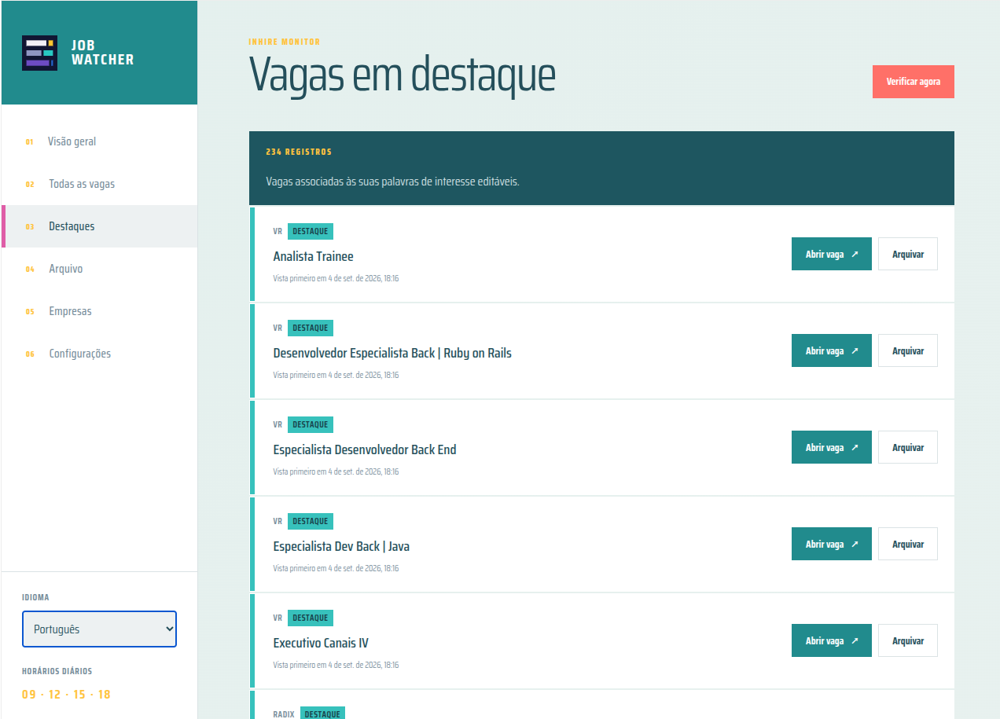

# Job Watcher

Job Watcher is a local web dashboard that monitors company career pages and identifies newly published opportunities. It is designed for developers who want a calm, private, and visually polished way to follow multiple job sources from their own computer.

The first supported platform will be InHire. The project will be structured so that other job platforms can be added later through independent source adapters.

## Interface preview



## Status

The first functional version is available. It includes the InHire collector, persistent history, scheduled checks, a bilingual local dashboard, company management, profile highlights, and job archiving.

## Experience

- Local browser based dashboard
- English interface by default
- Brazilian Portuguese interface option
- Per browser language persistence through localStorage
- Overview of new and highlighted opportunities
- Activity page with live check progress, per company state, check history, and a clear note that the app stays usable during a check
- Complete active job listing
- One click "Applied" action that archives a job with the applied reason
- Manual job archiving and restoration
- Archive reasons shown as one click chips, with an optional personal note
- A short action modal right after opening a job, offering Applied, Archive, or keep it active
- Toast confirmations with an undo option after archiving or applying
- Visited indicator once a job link has been opened, kept in the database
- Highlighted border on the job most recently opened, kept in the browser
- Automatic archiving when a job disappears from its source
- Dedicated archive with indefinite history
- Company source management from the interface
- Direct links that open job posts in a new browser tab
- Editable keywords for software development, AI, mobile, backend, frontend, full stack, and technical leadership roles
- Short, flat styled transitions for modals, toasts, and list changes, off by default under reduced motion preferences

## Schedule

The monitor is planned to run every day in the `America/Sao_Paulo` timezone at:

- 09:00
- 12:00
- 15:00
- 18:00

Weekends and holidays are included. If the computer is unavailable during one or more scheduled checks, Job Watcher will perform one catch up check when the service starts again.

The first successful collection creates the baseline. Jobs already present during that collection will not be marked as new.

## Technology

- Python
- FastAPI
- Server rendered HTML
- SQLite
- httpx for direct calls to the InHire public API
- Docker Compose

The project intends to avoid a frontend JavaScript toolchain. If JavaScript dependencies become necessary, pnpm will be used.

## Collection

Job Watcher reads listings straight from the InHire public API instead of rendering
career pages in a browser. For each company source it calls:

```http
GET https://api.inhire.app/job-posts/public/pages/lean
Content-Type: application/json
X-Tenant: <tenant>
```

The tenant is taken from the first label of the source host, so
`https://lyncas.inhire.app/vagas` uses the tenant `lyncas`. The career page is
taken from the path: `/vagas` means the default career page, while
`/octadesk/vagas` or `/supero/vagas` select the `octadesk` and `supero` career
pages. Results are filtered by that career page so a shared tenant only reports
the jobs that belong to the registered source.

Each listing entry gives a stable `jobId` used as the external identifier, a
`displayName` used as the title, and a link back to the public job post.
Collection uses a small concurrency limit, short timeouts, and a brief retry for
transient failures only (timeouts, connection errors, HTTP 429, and HTTP 5xx).
A failed or unconfirmed collection never archives a company's jobs; jobs are only
archived when the API returns a valid response for the correct career page and a
job is absent from it.

This approach removed the Playwright and Chromium dependency, which makes the
scan much faster and the Docker image much smaller.

## Visual direction

The interface will draw inspiration from the Windows 8 Metro design language:

- Square corners and rectangular tiles
- Flat, high contrast color areas
- Light neutral canvas and white panels
- Teal, turquoise, pink, coral, yellow, and purple flat color blocks
- Strong typography
- Minimal decoration and restrained motion

The logo and favicon use three geometric job rows with distinct status blocks. The mark represents monitored listings and changing job states without using initials or a letter based monogram.

## Local deployment

The application runs with Docker Compose on Ubuntu and restarts automatically with Docker. It binds only to the local computer by default.

### Start

```bash
docker compose up -d --build
```

Open [http://localhost:17843](http://localhost:17843) in a browser.

The first collection starts automatically and creates the baseline. With 30 sources over the InHire API it finishes in a few seconds. Refresh the dashboard to see collected jobs.

### Stop

```bash
docker compose down
```

The database remains in the `job-watcher-data` Docker volume.

### Configuration

Copy `.env.example` to `.env` only when you want to change the local port or timezone.

```dotenv
JOB_WATCHER_PORT=17843
JOB_WATCHER_TIMEZONE=America/Sao_Paulo
```

The interface language is independent for each browser profile and is stored only in browser localStorage.

## Activity page

The activity page (`/activity`) reports what a check is doing while it runs:

- Overall progress as "companies checked" out of the total, with a per company
  state of waiting, collecting, done, or failed.
- A plain statement that every other page keeps working during a check. Only
  starting a second manual check is blocked until the current one finishes.
- A stalled warning when a running check has not updated its heartbeat for a
  few minutes. The next scheduled check starts a fresh run.
- History of recent checks with duration, status, and job counts.
- The last result and last check time for each company source.

While a check is running the page refreshes itself every few seconds with a
plain meta refresh, so it needs no custom JavaScript. A leftover running check
from a process that stopped mid run is closed out as failed on the next start.

## Data behavior

- The first successful check for each company creates its baseline.
- New jobs are marked during the check in which they are discovered.
- Jobs missing from a successful source collection are archived, never deleted.
- Jobs that return after source archiving are restored and marked as reopened.
- Manually archived jobs record a reason and may include a personal note.
- Manual reasons include already applied, no interest, work arrangement, requirements, compensation, closed applications, and other.
- Manually archived jobs remain archived while their source stays active.
- Removing a company stops monitoring and archives its active jobs while preserving history.
- The first and last time a job link is opened are recorded in SQLite.
- Undoing an archive restores the job without marking it as reopened. That label stays reserved for jobs the source itself brings back.

## Development

Run the test suite with:

```bash
python -m unittest discover -v
```

The application intentionally uses one server worker because the scheduler runs inside the web process. This prevents duplicate scheduled checks.
