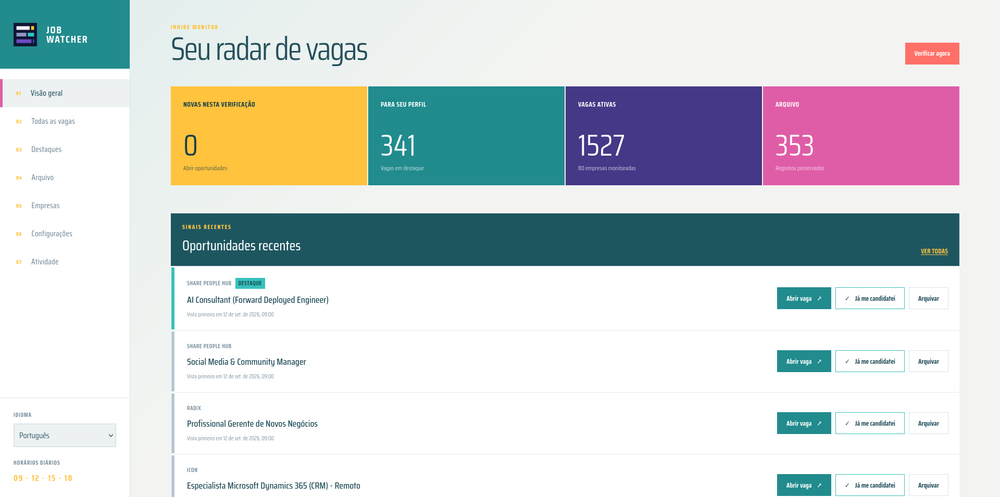
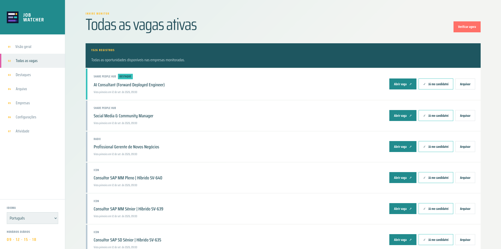
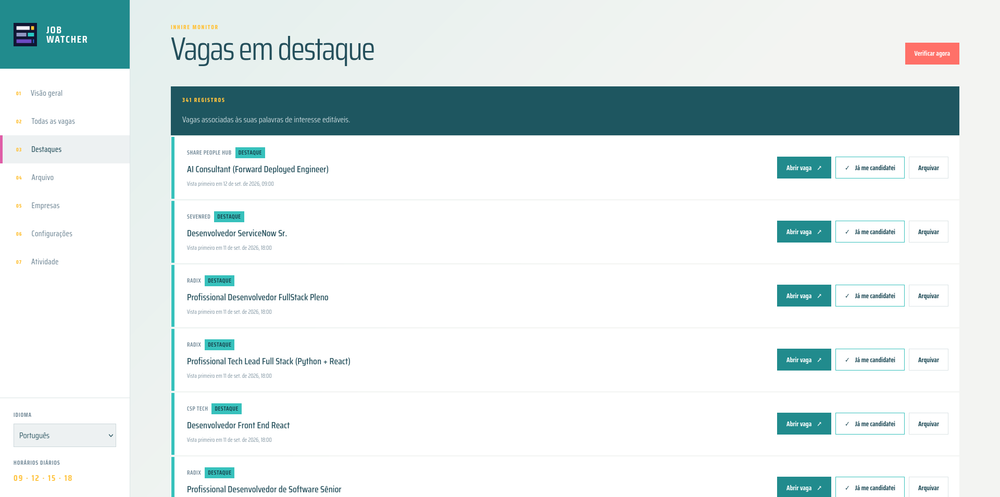
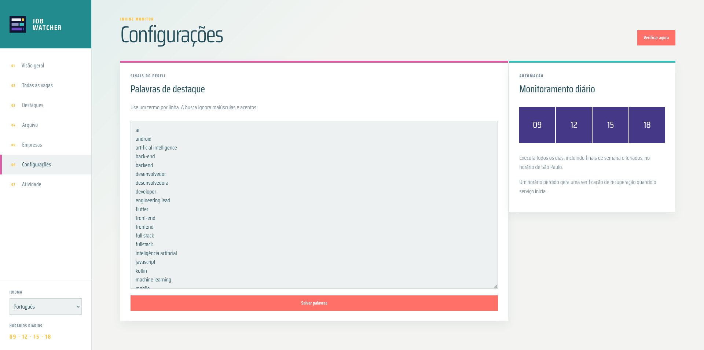
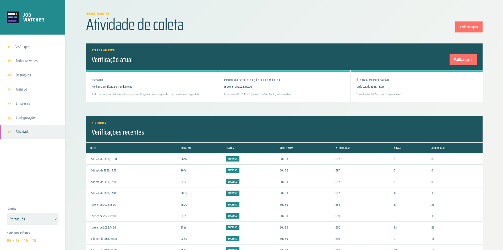

# Job Watcher

Job Watcher é um dashboard self-hosted que acompanha páginas de carreira de empresas e reúne novas vagas publicadas em um único lugar. Em vez de abrir dezenas de páginas de carreira manualmente, você consulta um único painel.

A primeira fonte suportada é o InHire, lido diretamente pela API pública. Outras plataformas podem ser adicionadas depois, seguindo o mesmo padrão de adapter.

## Rodando localmente

```bash
git clone <repo-url>
cd job-watcher
docker compose up -d --build
```

Abra [http://localhost:17843](http://localhost:17843). A primeira verificação roda automaticamente e monta a base em cerca de dez segundos; atualize a página para ver as vagas coletadas.

Não é necessário um arquivo `.env` para começar. Copie `.env.example` para `.env` apenas se quiser mudar a porta local ou o fuso horário:

| Variável | Padrão | Finalidade |
| --- | --- | --- |
| `JOB_WATCHER_PORT` | `17843` | Porta do host para o dashboard |
| `JOB_WATCHER_TIMEZONE` | `America/Sao_Paulo` | Fuso horário das verificações diárias |

Os dados ficam no volume Docker `job-watcher-data`. Nunca rode `docker compose down -v`, isso apaga o volume e todo o histórico de vagas.

## O que ele faz

- Monitora páginas de carreira de várias empresas através da API do InHire
- Roda verificações automáticas todos os dias às 09:00, 12:00, 15:00 e 18:00 (fuso configurável), com uma verificação de recuperação caso a aplicação tenha ficado offline
- Detecta novas vagas e arquiva as que desaparecem de uma fonte, sem nunca excluir o histórico
- Lista todas as vagas ativas, paginadas
- Destaca vagas que combinam com suas palavras chave de interesse, editáveis na página de Configurações
- Permite marcar uma vaga como já candidatada, ou arquivar manualmente com motivo e nota
- Mantém um indicador de visitado assim que você abre o link de uma vaga
- Mostra uma página de atividade com o progresso ao vivo de uma verificação em andamento, histórico de checagens e o último resultado por empresa
- Suporta uma ação manual de "verificar agora" a qualquer momento
- Interface em inglês e português do Brasil, alternável por navegador

## Empresas monitoradas

O projeto já vem com um conjunto inicial de empresas monitoradas, cadastrado na primeira execução.

Para adicionar as suas, abra a página **Empresas** no dashboard e informe a URL da página de carreira. Não é preciso alterar código para fontes do InHire.

Se preferir editar a lista inicial diretamente, ela fica em [`app/database.py`](../app/database.py) como `SEED_COMPANIES`.

## Screenshots

<table>
<tr>
<td></td>
<td></td>
</tr>
<tr>
<td></td>
<td></td>
</tr>
<tr>
<td colspan="2"></td>
</tr>
</table>

## Mais documentação

Veja [AGENTS.md](../AGENTS.md) para as diretrizes de produto e técnicas por trás deste projeto.
